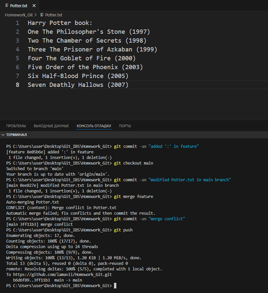

# Практическое задание по курсу «Git basic»

1. Создала репозиторий: [Homework_Git](https://github.com/lamavii/Homework_Git) и склонировала на локальный ПК, используя `git clone`.
2. Создала и внесла изменения в `Potter.txt`.

3. Запушила изменения на GitHub через `git push`.
4. Создала и перешла в новую ветку: `git checkout -b feature`.
5. Внесла изменения и закоммитила их: `git commit -am "added Potter.txt in feature branch"`.
6. Перешла в `main`, повторно изменила `Potter.txt`, затем сохранила его:

7. Слила `feature` с `main`.  

8. Внесла изменения в `main`.  

9. Вмерджила `feature` в `master` и обновила `Potter.txt`, разрешила конфликт в ветке `master` таким образом, чтобы в результате получился правильный вариант текста.  

